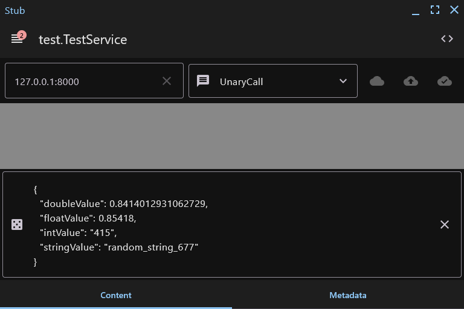

<h1 align="center">Stub</h1>

|                                                                  🌟                                                                   |                  Support this project                   |               
|:-------------------------------------------------------------------------------------------------------------------------------------:|:-------------------------------------------------------:|
|    | <code>bc1qs6qq0fkqqhp4whwq8u8zc5egprakvqxewr5pmx</code> | 
|  | <code>0x3147bEE3179Df0f6a0852044BFe3C59086072e12</code> |
|     |     <code>TKznmR65yhPt5qmYCML4tNSWFeeUkgYSEV</code>     |

 

Desktop client for testing gRPC services

 

 

> The application was designed using the [Reduce & Conquer](https://github.com/numq/reduce-and-conquer) architectural
> pattern

## Features:

- All types of calls are supported (Unary, Client, Server, Bidirectional)
- Request (messages) in JSON format
- Metadata in JSON format
- Generating a request with random data
- Notification about missing dependencies
- Preview of the proto file
